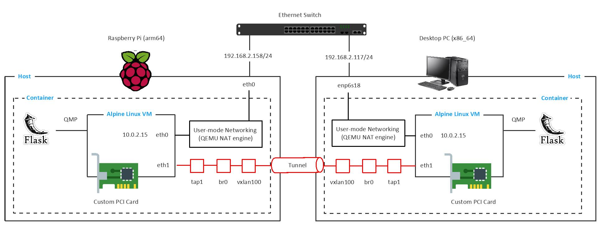
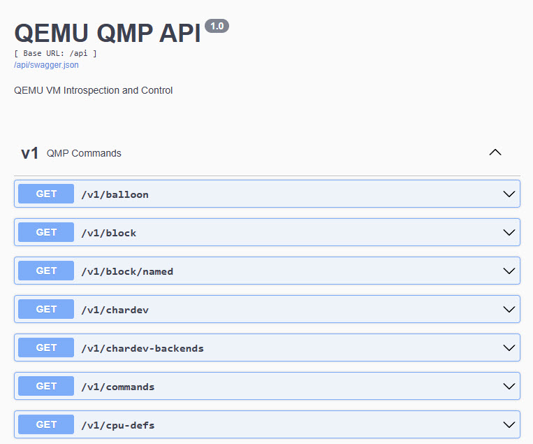
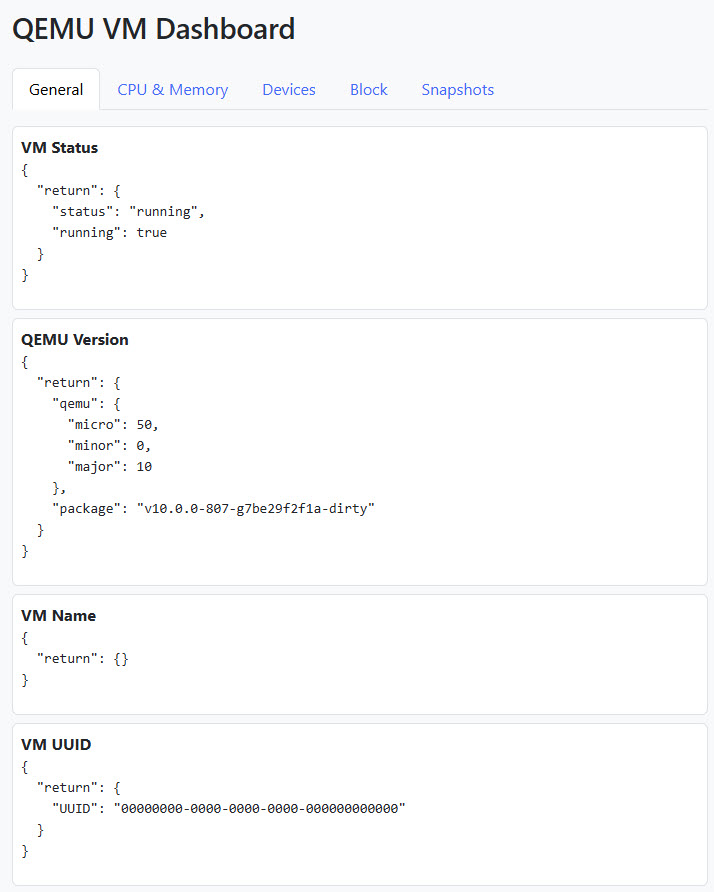

# QEMU-LabNet

qemu-labnet is a cross-architecture virtualization testbed designed to emulate and interconnect virtual machines across heterogeneous hardware platforms. The project deploys two lightweight QEMU virtual machines — one running on a ARM64 system such as Raspberry Pi 5, and the other on an x86_64-based system like the UM890 Pro. These VMs are configured to communicate with each other, enabling bi-directional traffic exchange for testing network protocols, interoperability, and performance across architectures.

To maintain visibility and control over VM behavior, the project leverages QEMU's QMP (QEMU Machine Protocol), which provides a programmatic interface to observe live VM state, retrieve metrics, and issue commands such as snapshots, resets, and device management. A Flask-based web application is setup to serve as a user interface for managing and visualizing the virtual lab. Through this interface, users can monitor VM health, observe traffic flows, and send commands through QMP.



## QEMU (Quick Emulator)

QEMU is an open-source emulator that can perform hardware virtualization. QEMU operates in several modes:

- **System Emulation**: QEMU emulates an entire hardware platform, including the CPU, memory, storage, and a variety of peripheral devices. This mode enables the execution of complete operating systems designed for different architectures, making it ideal for development, testing, and system-level experimentation. It provides a self-contained virtual environment that behaves like a physical machine.

- **User-mode Emulation**: In this mode, QEMU emulates individual user-space programs compiled for a different CPU architecture than the host. It enables cross-architecture binary execution without the need to emulate an entire system. For example, an ARM binary can be run on an x86 host without recompilation. This is particularly useful for debugging or testing cross-compiled applications.

- **Virtualization**: QEMU can operate as a hardware-assisted hypervisor by integrating with virtualization backends such as the Linux Kernel-based Virtual Machine (KVM). When paired with KVM, QEMU leverages the host CPU to execute guest code directly, providing near-native performance. In this role, QEMU acts as either a standalone virtual machine monitor (VMM) or as a device model provider for other hypervisors like Xen, Apple's HVF (on macOS), and Microsoft's WHPX (on Windows).

Our primary focus is on system emulation accelerated with KVM, where QEMU emulates full hardware platforms while leveraging hardware virtualization through KVM interface. This places the project at the intersection of system emulation and virtualization in QEMU's architecture.

## Getting Started

This project runs two QEMU virtual machines on separate hardware platforms:

- One VM runs on a Raspberry Pi 5 (ARM64)
- The other VM runs on a UM890 Pro mini-pc (x86_64)

Both hosts are running Ubuntu 22.04 LTS. Each VM is launched using QEMU in system emulation mode, accelerated by KVM. To ensure optimal performance, KVM must be enabled on both hosts. To verify KVM support, run the following commands on each host machine.

```bash
sudo apt update
sudo apt install -y cpu-checker
sudo kvm-ok
```

A successful check should output:

```text
/dev/kvm exists
KVM acceleration can be used
```

To maintain a clean host environment, we build QEMU from source within a Docker container. This approach isolates build dependencies and avoids polluting the host system. While running virtual machines inside a container is not ideal for production use due to performance and hardware access limitations, it serves our current goals of education, experimentation, and functional testing effectively. The virtual machine runs Alpine Linux, a lightweight and efficient distribution well-suited for testing and development environments.

Refer to [here](QEMU_Setup.md) for setting up QEMU on both hosts.

## Bridging Two VMs

In this setup, we connect the two VMs. Both VMs are executed inside privileged containers that have access to /dev/net/tun, and the host network stack. Each VM is configured with two virtual network interfaces:

- `eth0`: Connected via QEMU's user-mode networking, providing outbound internet access via NAT.
- `eth1`: Connected to a tap interface. This interface facilitates direct Layer 2 communication between the VMs.

A helper script (`setup_vm_network.sh`) is run inside the container on each host to:

- Create a `tap1` interface (used by QEMU for eth1) if does not exists.
- Create a Linux bridge (`br0`) and attaches `tap1`.
- Create `vxlan100` that encapsulates Ethernet frames over UDP port 4789, pointing to the peer host's IP.
- Bridge `vxlan100` to `br0`, effectively connecting both VMs to the same virtual switch over the network.

Since the eth1 interface on each virtual machine is bridged to a common Layer 2 network via VXLAN, it is essential that each VM has a unique MAC address on this interface. By default, QEMU assigns the same MAC address to each virtual NIC unless explicitly overridden. This default behavior can lead to MAC address conflicts, which are not acceptable in a bridged Layer 2 environment. To avoid these issues, we have explicitly assigned unique and deterministic MAC addresses to the eth1 interfaces of each VM.

On the Mini-PC, execute the network setup script inside the container to initialize the VXLAN:

```bash
/workspace# ./setup_vm_network.sh --peer-ip 192.168.2.158

[WARN] TAP interface tap1 already exists
[INFO] Creating bridge: br0
[INFO] Creating VXLAN interface: vxlan100 (remote: 192.168.2.158)
[INFO] Adding vxlan100 to bridge br0
[INFO] Adding tap1 to bridge br0
[INFO] VM Network configured: tap1 <-> br0 <-> vxlan100 <-> 192.168.2.158
```

The warning `[WARN] TAP interface tap1 already exists` is expected and not an error. It indicates that the TAP interface was already created by QEMU during VM startup for the eth1 interface. The script safely detects and continues with the bridge and VXLAN configuration without attempting to recreate it.

Inside the x86_64 VM, assign static IPv4 address to eth1:

```bash
ip addr add 10.10.10.2/24 dev eth1
ip link set eth1 up
```

On the Raspberry Pi 5 side follow similar steps:

```bash
/workspace# ./setup_vm_network.sh --peer-ip 192.168.2.117

[WARN] TAP interface tap1 already exists
[INFO] Creating bridge: br0
[INFO] Creating VXLAN interface: vxlan100 (remote: 192.168.2.117)
[INFO] Adding vxlan100 to bridge br0
[INFO] Adding tap1 to bridge br0
[INFO] VM Network configured: tap1 <-> br0 <-> vxlan100 <-> 192.168.2.117
```

Inside the ARM64 VM, assign static IPv4 address to eth1:

```bash
ip addr add 10.10.10.1/24 dev eth1
ip link set eth1 up
```

Once both VMs are configured with IP addresses on eth1, we can verify connectivity across the VXLAN tunnel:

From Raspberry Pi VM → Mini PC VM:

```bash
ping 10.10.10.2

PING 10.10.10.2 (10.10.10.2): 56 data bytes
64 bytes from 10.10.10.2: seq=0 ttl=64 time=1.760 ms
64 bytes from 10.10.10.2: seq=1 ttl=64 time=1.095 ms
64 bytes from 10.10.10.2: seq=2 ttl=64 time=1.402 ms
```

From Mini PC VM → Raspberry Pi VM:

```bash
ping 10.10.10.1

PING 10.10.10.1 (10.10.10.1): 56 data bytes
64 bytes from 10.10.10.1: seq=0 ttl=64 time=0.809 ms
64 bytes from 10.10.10.1: seq=1 ttl=64 time=0.950 ms
64 bytes from 10.10.10.1: seq=2 ttl=64 time=1.959 ms
```

## Sharing Data between Host and VM

Sharing data between a host system and a virtual machine is a foundational requirement in virtualized environments. Whether you're transferring configuration files, logs, datasets, or binaries, an efficient and reliable method to move data between the host and guest VM streamlines development, testing, and automation workflows. QEMU supports a variety of mechanisms for data sharing between host and guest OS:

| Method        | Bi-directional?  | R/W Access?  | Performance  | Networking Required? | Guest Support Required?  |
|---------------|------------------|--------------|--------------|----------------------|--------------------------|
| ISO           | Host → Guest     | Read-only    | High         | No                   | No                       |
| SCP/Rsync     | Yes              | Yes          | Medium       | Yes                  | SSH server/client        |
| SSHFS         | Yes              | Yes          | Medium       | Yes                  | SSH server/client        |
| NFS/SMB       | Yes              | Yes          | High         | Yes                  | Yes                      |
| QEMU TFTP     | Host → Guest     | Read-only    | Low          | Yes                  | TFTP client              |
| 9pfs          | Host → Guest     | Yes          | Medium       | No                   | Yes (kernel module)      |
| Virtio-FS     | Yes              | Yes          | High         | No                   | Yes (virtiofs driver)    |

- Bi-directional

    Bi-directionality refers to whether both the host and the guest can exchange data in either direction using the same mechanism. Methods like SCP, SSHFS, NFS/SMB, and Virtio-FS enable two-way data access and synchronization. In contrast, ISO, TFTP and 9pfs are unidirectional, only exposing data from the host to the guest without allowing the host to interact with guest-side files through the same interface.

- R/W Access

    This indicates whether the guest VM can read from and write to the shared resource. Some methods, like ISO or TFTP, are inherently read-only, making them suitable for static content delivery. Others, like SCP, SSHFS, NFS, 9pfs, and Virtio-FS, support read/write access, allowing the guest to not only consume files but also modify or create them on the shared mount.

- Performance

    This reflects the relative speed and efficiency of each method in transferring or accessing files. Virtio-FS and NFS generally offer the best performance for high-throughput or low-latency workloads, making them ideal for sharing large codebases or datasets. SSHFS and 9pfs provide moderate performance, sufficient for interactive or lightweight tasks. TFTP and ISO are read-only and slower, suited only for bootstrapping or static provisioning.

- Networking Required

    This indicates whether the data sharing mechanism relies on network connectivity between the host and the guest. Techniques like SCP, SSHFS, NFS/SMB, and TFTP require the guest to be reachable over a network interface, and often require services (e.g., SSH or NFS daemons) to be running. In contrast, ISO, 9pfs, and Virtio-FS work entirely through virtual hardware channels and do not require networking, making them ideal for minimal or isolated environments.

- Guest Support Required

    This indicates whether the guest OS needs specific drivers or modules to use the sharing method. Virtio-FS requires a modern Linux kernel with the virtiofs driver; 9pfs needs 9p and virtio support. NFS/SMB, SSHFS, and SCP require user-space tools or services like sshd, mount.nfs, or sshfs. In contrast, ISO and TFTP need minimal or no guest-side configuration, making them highly portable and easy to use across operating systems.

In this project, we use 9pfs (Plan 9 Filesystem) to share a directory from the host system to the guest virtual machine. This approach allows the guest OS to access and modify files in a specified host directory without requiring network connectivity. It is lightweight, does not depend on a network stack, and is particularly suitable for development and test environments. To configure 9pfs in QEMU, we have included the following options when launching the VM:

```bash
-fsdev local,id=myfs,path=/workspace,security_model=mapped \
-device virtio-9p-pci,fsdev=myfs,mount_tag=workspace-shared \
```

This setup shares the host's `/workspace` directory with the guest, using the mount tag `workspace-shared`.

Once the virtual machine is running, mount the shared directory inside the guest OS:

```bash
mount -t 9p -o trans=virtio workspace-shared /mnt
```

After mounting, you can change to the shared directory:

```bash
cd /mnt
```

The contents of `/workspace` on the host will now be accessible from `/mnt` inside the guest. Both the host and guest can read and write files within the shared folder. We are using the `mapped` security model, which maps file ownership between the host and guest. This means:

- The guest sees the host’s actual file ownership and permissions.
- Files created by the guest will appear on the host with the guest's UID/GID.

## Sending Traffic Between Two VMs

Once the layer 2 connectivity between two VMs is working via eth1, you can use Scapy to craft and send IPv4 packets between them for testing and demonstration.

Install Scapy inside both virtual machines:

```bash
echo "http://dl-cdn.alpinelinux.org/alpine/v3.21/community" >> /etc/apk/repositories
apk update
apk add python3 py3-virtualenv py3-pip libpcap libpcap-dev tcpdump
python3 -m venv /workspace/venv
source /workspace/venv/bin/activate
pip3 install scapy
```

You should be able to access Scapy script from the `/mnt` folder.

Start `scapy_receive.py` on the VM in mini-PC:

```bash
python3 /mnt/scapy_receive.py

[*] Listening for IP packets on eth1...
```

Run `scapy_send.py` on the VM in Raspberry Pi node:

```bash
python3 /mnt/scapy_send.py

Sent 5 packets.
```

On the receive side, you should be able to see:

```text
Received packet: 10.10.10.1 → 10.10.10.2
Payload: Hello from Scapy on eth1
----------------------------------------
Received packet: 10.10.10.1 → 10.10.10.2
Payload: Hello from Scapy on eth1
----------------------------------------
Received packet: 10.10.10.1 → 10.10.10.2
Payload: Hello from Scapy on eth1
----------------------------------------
Received packet: 10.10.10.1 → 10.10.10.2
Payload: Hello from Scapy on eth1
----------------------------------------
Received packet: 10.10.10.1 → 10.10.10.2
Payload: Hello from Scapy on eth1
----------------------------------------
```

## QEMU Machine Protocol (QMP)

QEMU Machine Protocol (QMP) is a JSON-based protocol used to control QEMU instances. It allows you to issue commands to QEMU to manage virtual machines, such as starting, or stopping them. QMP provides a structured way to interact with QEMU instances programmatically, making it suitable for automation and integration with other software. QMP is accessed via a network socket (TCP or Unix domain socket) and can be used by scripts or external programs to control QEMU instances. To start the QMP server on QEMU, simply specify the `-qmp` option.

We use a Python script as [QMP client](qmp_client.py). Right when connected, the QMP server will issue a greeting message, which signals that the connection has been successfully established. When a client successfully establishes a connection, the server is in `capabilities negotiation mode`. Clients should use the `qmp_capabilities` command to enable capabilities advertised in the server greeting which they support. Once the capability negotiation is finished, the QMP server enters command mode. You can find QMP reference manual in [here](https://qemu-project.gitlab.io/qemu/interop/qemu-qmp-ref.html).

## QEMU VM Monitoring and Control

We can establish a connection to the QMP server to monitor live virtual machine state and control various aspects of its operation. The following capabilities are available:

**Monitoring and Visualization**

- System Metrics: Display real-time CPU and memory usage, block device statistics and interrupt requests (IRQs).
- Guest Introspection: Show VM uptime and running processes using the QEMU Guest Agent (if enabled).
- Device Inventory: List all attached virtual hardware devices and report their current states.
- Tracing and Debugging: Capture trace events such as block I/O operations and device register accesses.
- Logging: Filter trace events and stream them into a ring buffer or persist them to disk.
- Timeline Visualization: Visualize events for performance analysis and debugging.
- Hardware Topology: Display a complete virtual hardware layout, including the PCI bus tree and attached devices.
- Memory Mapping: Visualize the VM's memory layout to aid in debugging and optimization.

**Snapshot Management**

- On-Demand Snapshots: Create and restore VM snapshots during runtime.
- Snapshot Tree Management: Track the lineage of snapshots and observe state differences across versions.
- Crash Recovery: Automatically restore a previous snapshot following a VM crash.

**Device Control**

- Hot-Plug Support: Dynamically attach or detach PCIe devices (e.g., virtual disks or NICs) at runtime.
- I/O Benchmarking: Measure performance before and after hot-plug operations for comparative analysis.

**Fault Injection**

- Pause or resume vCPUs at random to test system resilience.
- Simulate block device I/O errors to validate error handling mechanisms.
- Throttle network interfaces or emulate physical disconnection.

## User Dashboard

A web-based frontend simplifies interaction with the QEMU/QMP backend by offering a user-friendly interface for real-time monitoring, control, and diagnostics of virtual machines.

We assume the QEMU VM is already running inside a container. To start the Flask application server, activate the virtual environment and launch the app in the background:

```bash
/workspace# source /opt/qemu-venv/bin/activate
/workspace# nohup python3 app.py > app.log 2>&1 &
```

The host exposes a comprehensive set of RESTful APIs, which the frontend consumes to retrieve and display QEMU system metrics and control interfaces.



Each VM exposes its own dashboard instance. Navigate to the corresponding node IP to access:

- Web Dashboard: http://ares.home:5000/
- Swagger API docs: http://ares.home:5000/api/docs
- API Base URL: http://ares.home:5000/api/v1/

The dashboard is built with Flask and Bootstrap, using JavaScript for asynchronous API calls. It presents system information in categorized tabs (General, CPU/Memory, Devices, Block, Snapshots) and allows live status inspection and VM control.



Note that QMP is not designed for concurrent requests unless explicitly managed via its correlation-id mechanism. If multiple Flask routes send QMP request simultaneously, they can interleave commands and responses which causes broken or mismatched JSON replies. To fix this issue we are using lock to avoid concurrent interference.

## Adding a Custom PCI Device

Adding a custom PCI device to QEMU involves writing a new device model in C language that conforms to QEMU’s device framework and integrating it into the build system. As part of the Docker image build, we copy the custom device source file in QEMU's source tree under `hw/pci/`. We then modify the `meson.build` file to compile and register it as part of the QEMU build. Once integrated, the device can be instantiated in a virtual machine using QEMU's `-device` option.

This setup is especially useful for hardware prototyping, driver development, teaching, and security research. Developers can test how the operating system enumerates and communicates with PCI devices, simulate DMA or memory-mapped I/O, and develop kernel modules without needing physical hardware. Communication with the device can be handled via standard mechanisms such as telnet to a QEMU-exposed character device or MMIO-backed register interfaces.

Refer to [here](PCI_doc.md) for more explanations.
